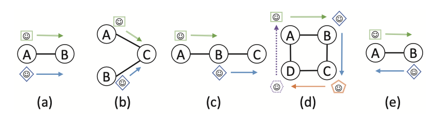

# Introduction

This is the challenge provided by KUKA at the SIAM Hackathon 2023. It is a set 
of intralogistic problems, for which an algorithm shall be developed that solves
as many problems as possible with plans so that each agent performs his tasks as
soon as possible.

# Getting started

To setup your machine for this challenge, do the following

1. Install [python 3.11](https://www.python.org/downloads/)  
   Be sure that it is on your PATH
2. Verify your installation with
    
    python -V
    
3. In this directory, run

    pip install -r requirements.txt

The file planner.py contains a template you can use to start coding. You only 
have to implement the *plan_problem* function. You can test your algorithm for 
all problems with

    python planner.py

To plan a specific problem only, run

    python planner.py problems/<name>

To open the visualization, run

    python visualization.py

# Problem description

Given is:

- a directed graph
- a set of agents located on the graph nodes
- a set of boxes, each located on a node, an agent, or nowhere
- a list of tasks assigned to the agents

Find a plan which lets the agents perform their assigned tasks as soon as
possible. Agents can move along the edges, pick a box from a node, drop a box 
onto a node, load an absent box, unload their box or wait at their current node.
Agents must not pick, drop, load or unload when they were not assigned a task to
do so.

Time is discretized and each task takes 1 timestep. During each timestep, each 
agent can perform at most one task.

There are some rules that the plan must fulfill:

- nodes can only carry one box at a time
- agents that carry boxes cannot move onto nodes that carry boxes
- agents cannot move to nodes occupied by other agents
- agents must complete their assigned tasks in the task lists order

The task are given in an ordering compatible with the dependencies between the 
tasks. Examples:

- agents never have two consecutive picks, due to their transport capacity
- agents never have drops for boxes they don't carry
- dropping a box requires an empty node, so if there is another box on that 
  node, a pick of that box will be ordered before the drop
  
Apart from that, the ordering of the tasks is arbitrary, and we expect you to
parallelize them efficiently.

## Tasks

A *move* task moves an agent *a* to a node *n*. For that, an edge must exist 
from the agent's current node to *n*, no other agent must be on *n* and *a* must
not carry a box when there is also a box on *n*.  
A *pick* task moves a box *b* from node *n* onto agent *a*. For that, the agent 
must be on *n*, the box must be on *n*, and *a* must not already carry a box.  
A *drop* task moves a box *b* from agent *a* onto node *n*. For that, the agent 
must be on *n*, the box must be on *a*, and *n* must not already carry a box.  
A *load* task puts an absent box *b* onto agent *a* while it is at node *n*.
For that, the agent must be on *n* and the box must be absent, and *a* must not 
already carry a box.  
An *unload* task removes box *b* from agent *a* while it is at node *n*. For 
that, the agent must be on *n* and the box must be on *a*.  
A *wait* task lets an agent *a* wait at its current node *n*.

# Score

The score of a plan evaluates the correctness and optimality of plans. For each
problem, a score of at most 1000 points can be reached. The score is computed as
sum of two features:

1. The number of non-waiting actions of all agents
2. The sum of completion times of all tasks

The first feature is commonly used to compare MAPF algorithms. It is a simple 
score which penalizes longer paths and unnecessary actions, like driving loops. 
But it doesn't penalize unnecessary waiting times and would prefer traffic jams 
over slightly longer, but faster alternative paths. The second feature fixes
that by penalizing tasks the longer they take to complete.

Eventually, the score is scaled relative to a lower bound for the optimal score. 
The lower bound is the score of a plan which contains conflicts, but performs 
each task within the minimum required timesteps.
This scaling ensures that smaller problems are weighted equally to larger 
problems. It also implies that a score of 1000 is only possible for some trivial
scenarios.

However, if a plan is incorrect, it will always be scored 0 points. A plan is
incorrect when:

- it contains unknown tasks or unknown objects
- a precondition is violated
- a conflict occurs
- a pick/drop/load/unload task was planned that was not ordered for that agent
- an ordered task was not completed, or completed in wrong order

**NOTE**: We do not score computation time, because:
  - it depends on your CPU power.
  - we don't want you to focus on performance optimizations like multithreading,
    but on exploiting problem structure and improving your approach.
  - there usually is plenty of time to optimize a plan after execution started,
    but constructing a good plan initially must be fast, so that execution can 
    start immediately.
  - in reality, the planned and actual execution times soon start to diverge due
    to various delays. So regular replanning or an online algorithm, which can
    adapt an existing plan, is necessary anyways.

Nonetheless, if your code takes a significant amount of time to construct a 
plan, it may be given a penalty.

To motivate you to focus on universal solutions, rather than developing
specialized code for the given scenarios, we may also run your algorithm against
a few problems that are not listed.

# File formats

The problems can be found in the **problems** directory. Each problem is 
defined in a separate subdirectory. Each problem contains the following files:

- *graph.xml*, which contains the nodes and edges in 
  [GraphML format](http://graphml.graphdrawing.org/primer/graphml-primer.html)
- *problem.yaml*, which contains the agents, boxes, the initial state and the
  task list in [YAML format](https://yaml.org)

Nodes, agents and boxes are represented with unique strings. By convention, 
nodes are prefixed with "n", agents with "a" and boxes with "b".

The plan for a problem must be saved as *plan.yaml* in the problem's directory.
It contains a mapping from the agents to a list of their tasks. The indices in 
the list are the timesteps.
The optimal plan for the *swap* problem would look like this

    ---
    a0: [[wait,a0,n00], [wait,a0,n00], [wait,a0,n00], [move,a0,n01], [move,a0,n02], [move,a0,n03]]
    a1: [[move,a1,n02], [move,a1,n01], [move,a1,n11], [wait,a1,n11], [wait,a1,n11], [move,a1,n01], [move,a1,n00]]

# Literature

The following may help you if you seek inspirations for solutions or information
about the related topics Multi-Agent Pathfinding (MAPF) and 
Multi-Agent Pickup and Delivery (MAPD).

- [mapf.info]( http://mapf.info )
  This is the homepage of a group of experts studying multi-agent pathfinding.
- [Multi-Agent Pathfinding: Definitions, Variants, and Benchmarks [2019]]( https://arxiv.org/pdf/1906.08291.pdf )  
  Introductory article that unifies terminology for describing common MAPF
  problems and objectives.
- [Lifelong Multi-Agent Path Finding for Online Pickup and Delivery Tasks [2017]]( https://arxiv.org/pdf/1705.10868.pdf )  
  One of the first articles that dealt with the continuous variant of path
  planning for multiple robots, in this case MAPD problems.

# FAQ

- Q: Can we use a different programming language?  
  A: Yes, but be sure that there is a GraphML and YAML library, to easily parse
     the input files and generate the output.

- Q: Can we implement different algorithms for different problems?  
  A: Yes, but your code should select the algorithm automatically, without using
     unique problem properties like its name or agent count.

- Q: Can we implement a portfolio planner?  
  A: Yes.
  
- Q: We think our plan is correct, but it is scored 0 points.  
  A: Tell us, maybe there is a bug in the score calculation.

- Q: What are the differences to general MAPF/MAPD problems?  
  A: The most significant are:  
  \- In MAPF/MAPD agents must have disjoint destination nodes, while in
     intralogistics, multiple agents often must move to the same node.  
  \- MAPF/MAPD does not consider dynamic environments, namely that boxes
     dropped on nodes block transports over such nodes.  
  \- MAPF/MAPD only rarely considers inter-task dependencies, like dropping on a
     node can only happen after another agent picked from there.  
  \- Many existing algorithms require that each agent has a reserved parking 
     location that does not block pathways, which is not given.  
  \- Some algorithms don't work on graphs that have dead-ends.  

- Q: What types of MAPF conflicts are considered?  
  A: All of the following are considered a conflict:  
  
